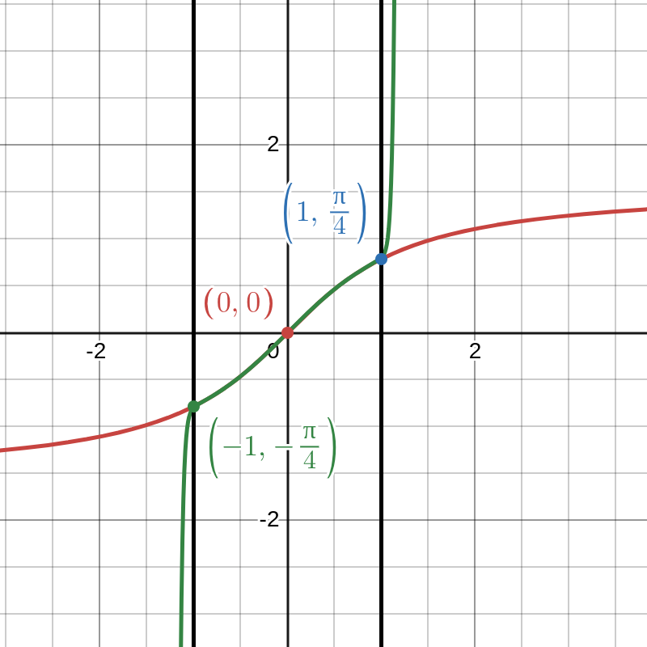

## Usage

**install dependencies:**

```bash
java --enable-preview build.java install
```

**build project:**

```bash
java --enable-preview build.java build
```

**run application:**

```bash
java --enable-preview build.java run <messages limit> <log requests> <openai api token>
```

**lint with checkstyle:**

```bash
java --enable-preview build.java lint
```

**test and generate coverage report:**

```bash
java --enable-preview build.java test
```

**run mutation testing:**

```bash
java --enable-preview build.java test-mutate
```

## План тестирования

### Анализ эквивалентности



Проанализируем поведение математической функции и ее программной реализации.

Поведение математической функции arctg на различных интервалах:

| Интервал     | Поведение математической функции        | Ожидаемое поведение программной реализации                         |
| ------------ | --------------------------------------- | ------------------------------------------------------------------ |
| \|x\| > 1    | Ряд не сходится                         | Функция возвращает ошибку IllegalArgumentException                 |
| \|x\| <= 0.9 | Ряд быстро сходится к значению arctg(x) | Функция возвращает arctg(x)                                        |
| x > 0, x < 1 | Ряд сходится к значению arctg(x) > 0    | Функция может превысить ITERATION_LIMIT и вернуть RuntimeException |

### Property-based тестирования

Для тестирования математических функций хорошо подходит Property-based тестирование.

Проверим, что выполняется следующее свойство: $\arctan(x) == -\arctan(-x)$
