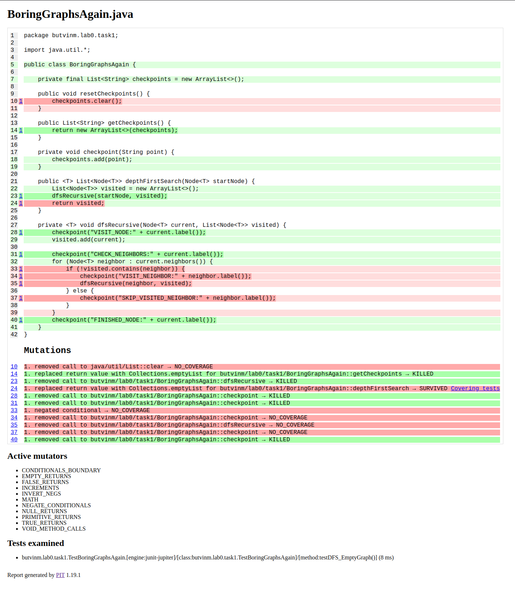
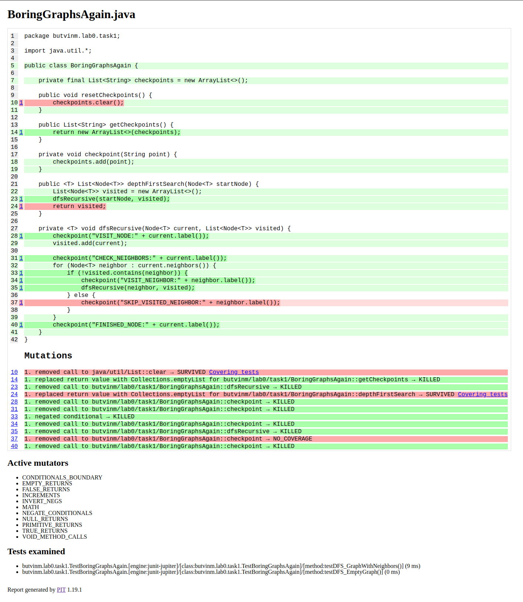
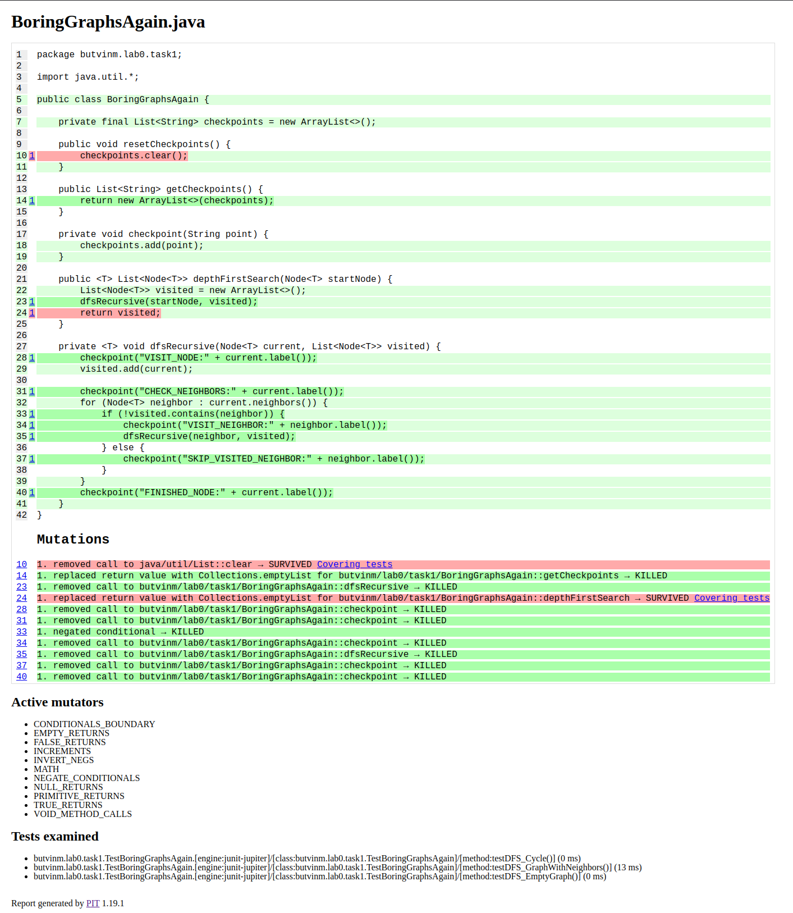
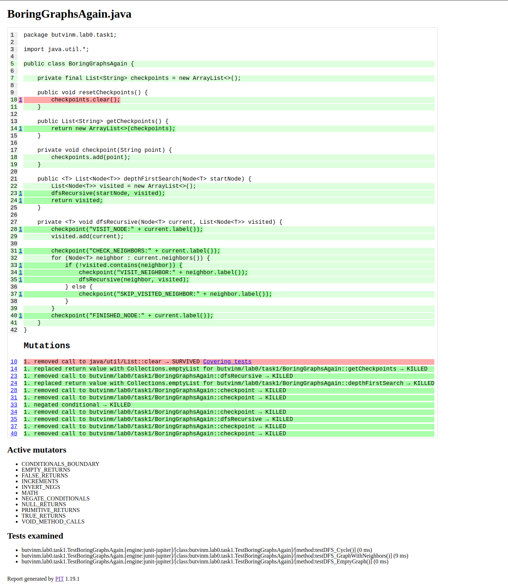

## Usage

**install dependencies:**

```bash
java --enable-preview build.java install
```

**build project:**

```bash
java --enable-preview build.java build
```

**run application:**

```bash
java --enable-preview build.java run <messages limit> <log requests> <openai api token>
```

**lint with checkstyle:**

```bash
java --enable-preview build.java lint
```

**test and generate coverage report:**

```bash
java --enable-preview build.java test
```

**run mutation testing:**

```bash
java --enable-preview build.java test-mutate
```

## План тестирования

Воспользуемся анализом покрытия кода и мутационным тестированием для выведения тест-кейсов

Начнем с одного простейшего тестового случая - графа с одной вершиной

**Результат:**



Очевидно, что мы никогда не доходим до итерации по соседям, потому что их нет.
Добавим тест-кейс с вершиной с несколькими соседями

**Результат:**



Остался непокрытым только код, проверяющий повторное прохождение вершины, то есть наличие в графе цикла.
Добавим такой тест-кейс.

**Результат:**



Теперь весь код покрыт тестами, но остались выжившие мутанты.

Первый мутант находится в функции `resetCheckpoints()`. Эта вспомогательная функция для тестирования, ее можем пропустить.

Второй мутант заменил возвращаемый список вершин на пустой и тесты не упали. Это произошло из-за того, что в тестах не было проверки возвращаемого значения - добавим ее.

**Финальный результат:**


